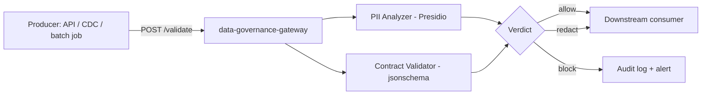

# data-governance-gateway

A **PII-detection and data-contract enforcement gateway** for data pipelines. It sits between a producer (an API, a CDC stream, an ingestion job) and downstream consumers, and answers two questions before data is allowed through: does this contain PII that shouldn't be here, and does it match the schema/contract the consumer expects?

## The gap this fills

Data governance is almost always bolted on after the fact: a breach or an audit finding triggers a scramble to add PII scanning, and schema drift between producers and consumers is usually discovered in production when a downstream job crashes. Open-source PII detection exists (Microsoft Presidio) and open-source schema validation exists (jsonschema, Great Expectations), but there's no small, opinionated, pipeline-shaped tool that combines both into a single enforcement point you drop in front of a Kafka topic, an API, or a batch load. That's what this project is.

## What it does

- Exposes a FastAPI service with a single POST /validate endpoint
- Runs Microsoft Presidio analyzers over incoming JSON records to detect PII (emails, phone numbers, credit card numbers, national ID numbers, names, etc.)
- Validates the record against a versioned YAML/JSON-schema **data contract** registered for that data source
- Returns a structured verdict: allow, block, or allow-with-redaction (PII fields masked), plus a list of every violation found
- Ships a CLI (contractctl) to register, version, and diff data contracts
- Logs every decision so you have an audit trail for compliance reviews

## Why this matters for regulated data (GDPR / HIPAA)

This project exists because governance is usually treated as a policy document, not a running system. A gateway that actively blocks or redacts non-compliant records at the point of transfer is a much stronger control than a quarterly manual audit - and is the kind of control an auditor can actually point to as evidence.

## Architecture



## Repository structure

```text
data-governance-gateway/
├── app/
│   ├── main.py                # FastAPI app, /validate endpoint
│   ├── pii_scanner.py         # Presidio-based PII detection
│   ├── contract_validator.py  # JSON-schema based contract validation
│   └── models.py              # Pydantic request/response models
├── contracts/
│   └── example_customer_v1.yaml
├── cli/
│   └── contractctl.py         # register/list/diff data contracts
├── tests/
│   ├── test_pii_scanner.py
│   └── test_contract_validator.py
├── docs/
│   ├── ARCHITECTURE.md
│   └── DEPLOYMENT.md
├── Dockerfile
├── docker-compose.yml
├── render.yaml
├── .github/workflows/ci.yml
└── requirements.txt
```

## Getting started (local, Docker Compose)

```bash
git clone https://github.com/Kornelius99/data-governance-gateway.git
cd data-governance-gateway
docker compose up --build
```

Then, from another terminal:

```bash
curl -X POST http://localhost:8000/validate \
  -H 'Content-Type: application/json' \
  -d '{"contract": "example_customer_v1", "record": {"name": "Jane Doe", "email": "jane@example.com", "age": 34}}'
```

This returns a verdict showing the email field flagged as PII, plus whether the record matches the example_customer_v1 contract.

## Deploying for real

- **Render**: render.yaml deploys the FastAPI service directly from your fork with one click (see docs/DEPLOYMENT.md). You need your own free Render account.
- **Docker anywhere**: the Dockerfile is a standard multi-stage-free Python image; run it on any container platform (ECS, Cloud Run, an existing Kubernetes cluster) by pointing it at the CONTRACTS_DIR volume/config.

## Extending this project

- Add a Kafka Streams / Faust wrapper so this can run as an actual stream-processing sidecar instead of a request/response API
- Add more Presidio recognizers for domain-specific identifiers (NHS numbers, IBANs)
- Add a small web UI for browsing the audit log and contract version history

## Honesty / limitations

- PII detection quality depends entirely on Presidio's underlying models - it will miss some PII and occasionally flag false positives; do not treat this as a certification of GDPR/HIPAA compliance, it is a control that supports compliance, not a substitute for legal review.
- I wrote and reviewed this code carefully but have not run it against a production data stream; please test thoroughly with your own sample data before relying on it.

## License

MIT — see [LICENSE](LICENSE).
