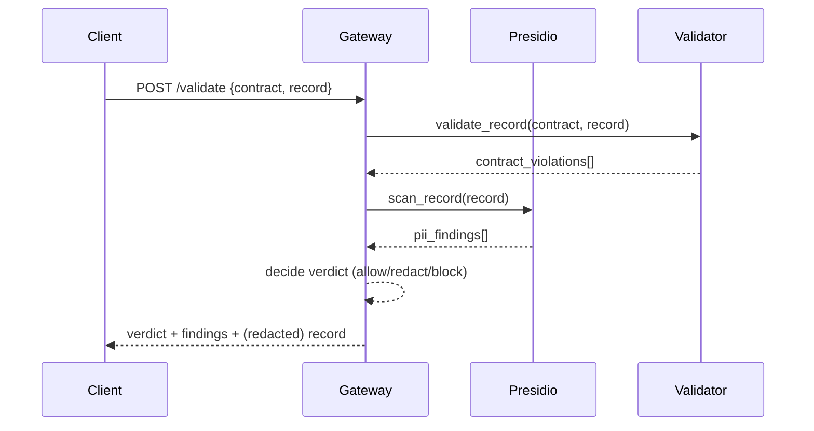

# Architecture notes

## Why a synchronous request/response gateway instead of a stream processor

Most teams' first governance need is at an API boundary or a batch load step, where a request/response model (POST a record, get back a verdict) integrates in a few lines almost anywhere: a Lambda, an API Gateway authorizer-style call, a pre-commit hook in an ETL job. A full streaming sidecar (Kafka Streams, Flink) is a legitimate v2 for high-throughput CDC pipelines, and is listed under Extending in the README, but it's a much bigger operational commitment than most teams need on day one.

## Why block-on-schema-violation but allow-with-redaction-on-PII by default

These two failure modes are different in kind. A schema violation usually means something upstream is broken (a producer shipped a bad deploy) and the safest default is to stop the bad data at the door. PII appearing in a field that wasn't declared as sensitive is often a legitimate record that just needs to be masked before it reaches a consumer that doesn't have a legitimate need to see it - blocking it outright would just break the pipeline instead of protecting anyone. Both behaviors are configurable per-request via the redact flag.

## Why contracts are files in a directory, not rows in a database

Data contracts should be reviewed the same way code is: in a pull request, with a diff, with git blame history. Storing them as YAML files in the same repository (or a separate contracts repo mounted as a volume) gets you that for free. contractctl diff exists specifically to make contract PRs reviewable - a reviewer can run it locally to see exactly what changed in plain English.

## Why Presidio instead of a regex-only PII detector

Regex catches structured PII (emails, phone numbers, credit cards) well but misses unstructured PII like names and addresses embedded in free text fields. Presidio combines regex recognizers with an NLP model (spaCy) for exactly this reason. The tradeoff is a heavier Docker image and slower cold start - documented in the Honesty section of the README.

## Request flow

## Known simplifications

- Contract lookup is by exact name only; there is no automatic latest-version resolution (e.g. example_customer resolving to the highest version) - callers must specify the exact contract file name.
- Presidio's language is hardcoded to English (language=en) in pii_scanner.py.
- There is no persistence layer for the audit log in this version - logger.info output should be shipped to your existing log aggregation (CloudWatch, Datadog, ELK) rather than treated as a queryable store.
